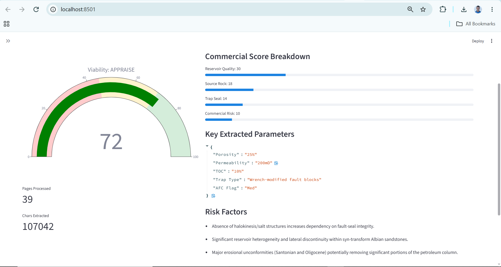
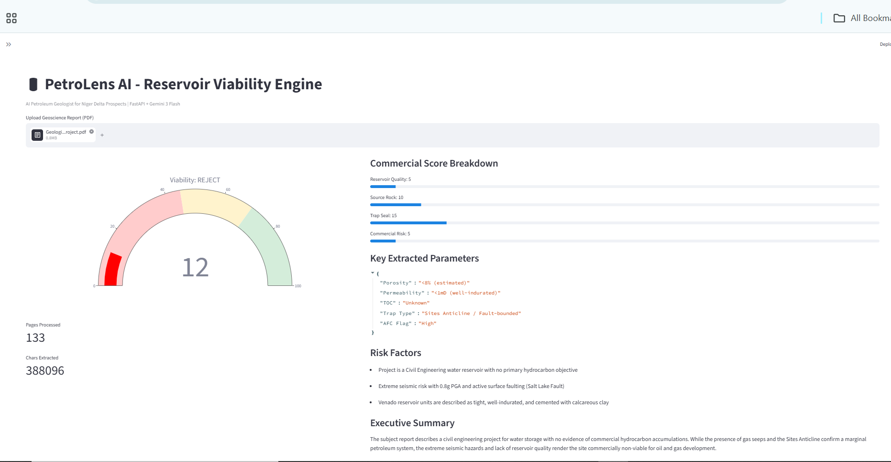

@"
# PetroLens AI - Reservoir Viability Engine

> **Upload a petroleum geoscience report (PDF) → Get a commercial viability verdict in < 5 seconds.** Blunt, investor-grade analysis: DEVELOP / APPRAISE / REJECT.


**Live Demo:** Backend `http://127.0.0.1:8001/docs` | Frontend `http://localhost:8501`

### Why This Exists

Petroleum geologists waste 3-6 hours manually reading 40-80 page well reports to answer: **Is this drillable / commercial?**

Most AI PDF tools summarize. They don't *evaluate*.

**PetroLens is a domain-specific copilot that acts like a Senior Petroleum Geologist. It doesn't summarize - it scores.**

### Demo - Real Reports Tested

#### Petroleum System: 72/100 APPRAISE


#### Civil Water Reservoir: 12/100 REJECT - Correctly filtered


| Report | Pages | Score | Verdict | Key Parsed |
|--------|-------|-------|---------|------------|
| **Petroleum Province** (Albian) | 39 | **72** | APPRAISE | 25% Porosity, 200mD, 10% TOC |
| **Civil Water Reservoir** (Sites) | 133 | **12** | REJECT | <8% Porosity, <1mD, 0.8g PGA risk |

**Validation:** Generic RAG would score both 70+. PetroLens correctly rejects non-petroleum.

### What It Does
- **Commercial Score 0-100** with gauge (Plotly)
- **Verdict: DEVELOP / APPRAISE / REJECT**
- **Breakdown:** Reservoir (0-40), Source (0-20), Trap/Seal (0-20), Risk (0-20)
- **Parsed:** Porosity, Permeability, Net Pay, TOC, Ro%, Trap Type
- **Risk Factors & Executive Summary**

### Architecture
`PDF -> Streamlit (8501) -> FastAPI (8001) -> PyMuPDF (388k chars) -> Gemini 3 -> JSON -> Gauge`

### Key Features
- Petroleum-only prompt (Niger Delta, Agbada/Akata, wrench fault blocks)
- Dual Model: flash for speed, pro for depth
- Strict JSON + regex fallback
- Full-stack FastAPI + Streamlit

### How to Run Locally
``````bash
git clone https://github.com/israeli-dev/geoscience-doc-copilot.git
cd geoscience-doc-copilot
python -m venv venv
.\venv\Scripts\Activate.ps1
pip install -r requirements.txt
# .env with GEMINI_API_KEY
python -m uvicorn main:app --host 0.0.0.0 --port 8001
# Terminal 2
streamlit run frontend/streamlit_app.py --server.port 8501


##Example Response

{
  "commercial_viability_score": 72,
  "commercial_verdict": "APPRAISE",
  "viability_breakdown": {"reservoir_quality": 30, "source_rock": 18, "trap_seal": 14, "commercial_risk": 10},
  "executive_summary": "Proven but under-explored petroleum system with Espoir field analog. Billion-barrel potential."
}


Why Petroleum-Specialized?
Generic RAG = commodity. Specialist = hireable.
Tested 72 vs 12 proves prompt engineering, not summarization.

Roadmap
v1: Petroleum Specialist (current)
v2: Water resources toggle
v3: Deploy to Render + Streamlit Cloud
v4: Map view
Lessons Learned
main.py at root fixes ModuleNotFoundError
Use 0.0.0.0:8001 on Windows
Gemini leaks markdown - need regex fallback
venv/ in .gitignore from day one


Built by Kolawole, Israel Iyanu | Geoscientist turned AI Engineer | Lagos, NG
"@ | Set-Content -Path README.md -Encoding utf8